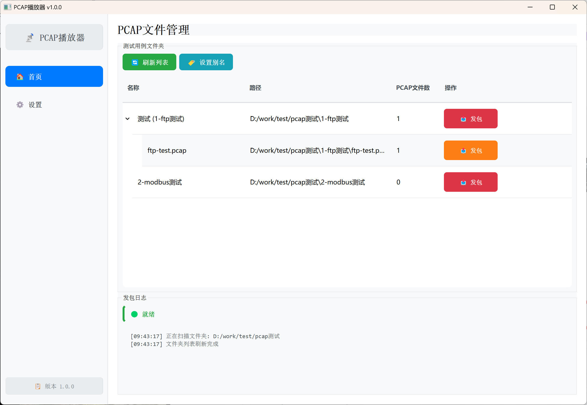

# PCAP播放器

一个基于PyQt5的桌面应用程序，类似于科来数据包播放器，用于管理和发送PCAP文件。增加了文件夹列表功能，方便快速进行每一项测试。



## 功能特性

- **文件夹管理**: 支持文件夹别名设置，方便组织测试用例
- **PCAP文件发送**: 支持单个文件或整个文件夹的批量发送
- **网络接口选择**: 自动检测可用网卡，支持自定义源IP地址
- **进度监控**: 实时显示发包进度和日志信息
- **数据库存储**: 使用SQLite存储设置和文件夹别名

## 系统要求

- Python 3.7+
- Windows操作系统
- 管理员权限（用于网络数据包发送）

## 安装步骤

1. 克隆或下载项目到本地
2. 安装Python依赖包：
   ```bash
   pip install -r requirements.txt
   ```
3. 以管理员权限运行程序：
   ```bash
   python main.py
   ```

## 使用说明

### 1. 设置配置

首次使用需要在"设置"页面配置：

- **目标文件夹**: 选择包含测试用例文件夹的根目录
- **网络接口**: 选择用于发送数据包的网卡
- **源IP地址**: 可选，留空使用接口默认IP

### 2. 管理测试用例

在"首页"可以：

- 查看所有测试用例文件夹
- 为文件夹设置别名，便于识别
- 展开文件夹查看包含的PCAP文件
- 执行单个文件或整个文件夹的发包操作

### 3. 发送数据包

- 点击文件夹或文件旁的"发包"按钮
- 确认发送操作
- 监控发送进度和日志

## 项目结构

```
playpcap/
├── main.py                 # 主程序入口
├── requirements.txt        # 依赖包列表
├── README.md              # 项目说明
├── database/              # 数据库模块
│   ├── __init__.py
│   └── db_manager.py      # 数据库管理器
├── ui/                    # 用户界面模块
│   ├── __init__.py
│   ├── main_window.py     # 主窗口
│   ├── home_page.py       # 首页
│   └── settings_page.py   # 设置页面
└── network/               # 网络模块
    ├── __init__.py
    └── packet_sender.py   # 数据包发送器
```

## 注意事项

1. **管理员权限**: 发送网络数据包需要管理员权限
2. **网络安全**: 请在受控环境中使用，避免对生产网络造成影响
3. **PCAP格式**: 支持.pcap和.pcapng格式的文件
4. **防火墙设置**: 可能需要配置防火墙允许程序访问网络

## 依赖库说明

- **PyQt5**: 图形用户界面框架
- **scapy**: 网络数据包处理库
- **psutil**: 系统和进程工具库

## 故障排除

### 常见问题

1. **无法发送数据包**
   - 确保以管理员权限运行
   - 检查网络接口是否正确选择
   - 确认防火墙设置

2. **找不到网络接口**
   - 点击"刷新"按钮重新扫描
   - 检查网卡驱动是否正常

3. **PCAP文件读取失败**
   - 确认文件格式正确（.pcap或.pcapng）
   - 检查文件是否损坏

## 许可证

本项目仅供学习和测试使用，请遵守相关法律法规。

## 版本历史

- v1.0.0: 初始版本，实现基本功能